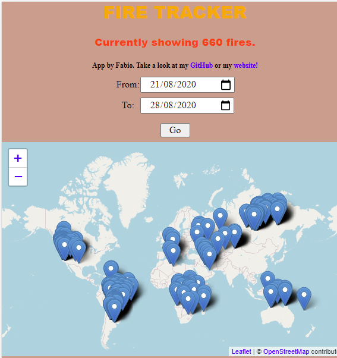

[![Contributors][contributors-shield]][contributors-url]
[![Forks][forks-shield]][forks-url]
[![Stargazers][stars-shield]][stars-url]
[![Issues][issues-shield]][issues-url]
[![MIT License][license-shield]][license-url]
[![LinkedIn][linkedin-shield]][linkedin-url]

<br />
<p align="center">
  <a href="https://github.com/fabio-mancin/fire-tracker">
    
  </a>

  <h3 align="center">Fire Tracker</h3>

  <p align="center">
    Map that shows the locations of fires within a specific date range.
    <br />
    <a href="https://github.com/fabio-mancin/fire-tracker"><strong>Explore the docs »</strong></a>
    <br />
    <br />
    <a href="https://fabio-mancin-fire-tracker.netlify.app/">View Demo</a>
    ·
    <a href="https://github.com/fabio-mancin/fire-tracker/issues">Report Bug</a>
    ·
    <a href="https://github.com/fabio-mancin/fire-tracker/issues">Request Feature</a>
  </p>
</p>

<details open="open">
  <summary><h2 style="display: inline-block">Table of Contents</h2></summary>
  <ol>
    <li>
      <a href="#about-the-project">About The Project</a>
      <ul>
        <li><a href="#built-with">Built With</a></li>
      </ul>
    </li>
    <li>
      <a href="#getting-started">Getting Started</a>
      <ul>
        <li><a href="#prerequisites">Prerequisites</a></li>
        <li><a href="#installation">Installation</a></li>
      </ul>
    </li>
    <li><a href="#usage">Usage</a></li>
    <li><a href="#roadmap">Roadmap</a></li>
    <li><a href="#contributing">Contributing</a></li>
    <li><a href="#license">License</a></li>
    <li><a href="#contact">Contact</a></li>
    <li><a href="#acknowledgements">Acknowledgements</a></li>
  </ol>
</details>

## About The Project



### Built With

* [VueJS](https://vuejs.org/)
* [Leaflet](https://leafletjs.com/)

## Getting Started

To get a local copy up and running follow these simple steps.

### Prerequisites

This is an example of how to list things you need to use the software and how to install them.

* npm

  ```sh
  npm install npm@latest -g
  ```

### Installation

1. Clone the repo

   ```sh
   git clone https://github.com/fabio-mancin/fire-tracker.git
   ```

2. Install NPM packages

   ```sh
   npm install
   ```

## Usage

You can test the app on <a href="https://fabio-mancin-fire-tracker.netlify.app/">Netlify</a>.

Select a date range to view the fires for those dates retrieved from a mock-ish API.

## Roadmap

See the [open issues](https://github.com/fabio-mancin/fire-tracker/issues) for a list of proposed features (and known issues).

## Contributing

Contributions are what make the open source community such an amazing place to be learn, inspire, and create. Any contributions you make are **greatly appreciated**.

1. Fork the Project
2. Create your Feature Branch (`git checkout -b feature/AmazingFeature`)
3. Commit your Changes (`git commit -m 'Add some AmazingFeature'`)
4. Push to the Branch (`git push origin feature/AmazingFeature`)
5. Open a Pull Request

## License

Distributed under the MIT License. See `LICENSE` for more information.

## Contact

Fabio Mancin: [@Fabio__Mancio](https://twitter.com/Fabio__Mancio) - fabio.mancin90@gmail.com

Project Link: [https://github.com/fabio-mancin/fire-tracker](https://github.com/fabio-mancin/fire-tracker)

## Acknowledgements

* [Start2Impact](https://www.start2impact.it/)

[contributors-shield]: https://img.shields.io/github/contributors/fabio-mancin/fire-tracker.svg?style=for-the-badge
[contributors-url]: https://github.com/fabio-mancin/fire-tracker/graphs/contributors
[forks-shield]: https://img.shields.io/github/forks/fabio-mancin/fire-tracker.svg?style=for-the-badge
[forks-url]: https://github.com/fabio-mancin/fire-tracker/network/members
[stars-shield]: https://img.shields.io/github/stars/fabio-mancin/fire-tracker.svg?style=for-the-badge
[stars-url]: https://github.com/fabio-mancin/fire-tracker/stargazers
[issues-shield]: https://img.shields.io/github/issues/fabio-mancin/fire-tracker.svg?style=for-the-badge
[issues-url]: https://github.com/fabio-mancin/fire-tracker/issues
[license-shield]: https://img.shields.io/github/license/fabio-mancin/fire-tracker.svg?style=for-the-badge
[license-url]: https://github.com/fabio-mancin/repo/blob/master/LICENSE.txt
[linkedin-shield]: https://img.shields.io/badge/-LinkedIn-black.svg?style=for-the-badge&logo=linkedin&colorB=555
[linkedin-url]: https://linkedin.com/in/fabio-mancin
